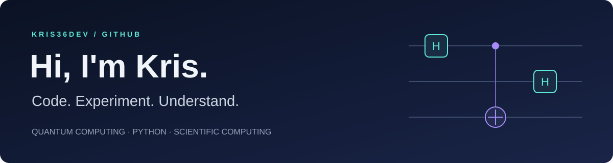

  

  Exploring quantum computing through small, reproducible Python experiments. 
  From mathematical ideas to working code, tests, and visual explanations.

  
  

## A little about my work

I'm interested in how quantum algorithms work, what resources they need, and how noise changes their results. My recent projects turn those questions into classical simulations with explicit assumptions and reproducible outputs.

- **Explore** entanglement, quantum queries, phase estimation, and variational algorithms.
- **Validate** numerical results against mathematical references and automated tests.
- **Explain** the findings with plots, datasets, and readable documentation.

## Featured experiments

<table>
<tr>
<td width="50%" valign="top">

### 01 · Entanglement Lab

What can shared entanglement accomplish?

Teleportation, superdense coding, and a CHSH experiment, with ideal results and synthetic noise comparisons.

**Focus:** quantum communication · validation

[Explore the lab →](https://github.com/kris36dev/entanglement-lab)

</td>
<td width="50%" valign="top">

### 02 · Noisy VQE Lab

When does noise mitigation actually help?

A two-qubit variational experiment comparing bias, variance, and total error at a fixed measurement budget.

**Focus:** optimization · noise · measurement trade-offs

[Explore the lab →](https://github.com/kris36dev/noisy-vqe-lab)

</td>
</tr>
<tr>
<td width="50%" valign="top">

### 03 · Phase Estimation Lab

How much precision can fewer ancillas preserve?

Standard and iterative phase estimation, plus a small order-finding and factoring demonstration.

**Focus:** numerical precision · resource trade-offs

[Explore the lab →](https://github.com/kris36dev/phase-estimation-lab)

</td>
<td width="50%" valign="top">

### 04 · Quantum Query Lab

When can quantum algorithms use fewer queries?

Deutsch–Jozsa classification and Simon's hidden-string algorithm, with query and sampling comparisons.

**Focus:** algorithms · hidden structure · sampling

[Explore the lab →](https://github.com/kris36dev/quantum-query-lab)

</td>
</tr>
</table>

These labs use classical simulations of small quantum systems. Each repository documents its methods, assumptions, and limitations.

## Tools & languages

  
  
  
  
  
  

## Beyond the quantum labs

My repositories also include [a Java bug tracker](https://github.com/kris36dev/BugTracker---Final-Project-CS) and [a JavaScript capstone project](https://github.com/kris36dev/CS691_CapstoneProject).

---

<b>Real eyes, Realize, Real lies.</b>

